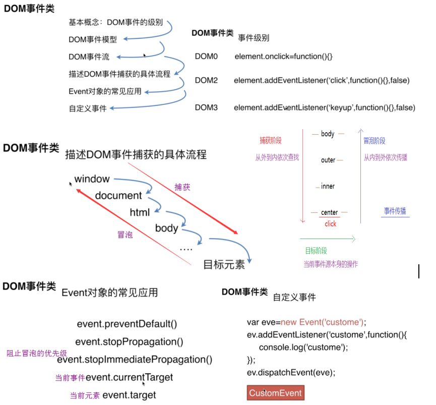

# 万能的 JS

@[TOC](种一棵树，最好的时候是十年前，其次是现在。)

## JS（JavaScript 轻量级动态脚本语言）

> JavaScript 基于原型编程、多范式的动态脚本语言，并且支持面向对象、命令式、声明式、函数式编程范式

- ECMAScript：**语法规范**，是 js 和 nodejs 要遵守的
- js 操作 dom，事件，发 ajax 请求 == `ECMAScript + webAPI`
- node 处理请求操作文件 == `ECMAScript + nodeAPI`

### 面向对象思想：

- 1.封装：保护成员、数据隐藏——方法、强制访问权限、便于理解
- 2.继承：重用代码、无需修改父类、*多重继承（组合）——JS 不支持、不好、*抽象类
- 3.多态：抽象、简化问题 （条件判断模拟多态）

### 作用域

- 1、全局作用域
  > - var 定义的全局变量不可以删除，没使用 var 定义的全局变量是 window 的属性存在，可删除`abcd=123，delete abcd =>true`
  > - 函数内部没有用 var 定义的全局变量也是 window 的属性存在
- 2、函数作用域
- 3、块状作用域 let&const

  > - let 块级作用域
  > - let 声明的全局变量不能用全局属性来访问。不会把变量定义到 window 上
  > - let 不能重新定义
  > - let 不会进行变量提升
  >
  > - const：常量，不可变的量，指针不能改，内容不可以改

  ```js
  // let的块级作用于
  for (var i = 0; i < 3; i++) {
    setTimeout(function () {
      console.log(i);
    }, 1000);
  } // 3 3 3 用 let 就是 0 1 2

  // let没有预解释
  console.log(a);
  var a = 1; // undefined
  let a = 1; // Cannot access 'a' before initialization 无法在初始化之前访问'a'

  // const不可变的量，指针不能改，内容不可以改
  const a = 1;
  a = 2; // Uncaught TypeError: Assignment to constant variable.
  const b = [1];
  b.push(2);
  console.log(b); // [1,2]
  Object.freeze(b); // =>彻底不能改
  b.push(3); // Uncaught TypeError: Cannot add property 3, object is not extensible
  ```

- 4、动态作用域

### 预解释 （变量提声） 浏览器天生自带

> 当前的作用域中，js 代码执行之前，浏览器首先会默认把所有的带 var 和 function 的进行提前的声明或者定义
>
> - 声明（declare）：var num；告诉浏览器在全局作用域中有一个全局的变量了
> - 定义（defined）：num=12；给变量进行赋值，把数据变量联系在一起

- var 和 function

  > - var 的变量提前声明但不会赋值（不定义），默认的值 undefined，当代码执行的时候才会赋值。
  > - function 提前声明并赋值（定义）

  ```js
    // 预解释只发生在当前的作用域下，例如：开始只对windows下的进行预解释，只有函数执行的时候才会对函数中的进行预解释
    console.log(num); //undefined
    console.log(obj); //undefined
    console.log(sum); //function本身
    var num=12;       //赋值
    function sum(num1,num2){var total=num1+num2;}
    var obj={'name':'zqb',age:30};  //对象开辟一个空间，将属性名和属性值存进去
    *****************************
    console.log(haha);        // 报错haha is not defined
    var a =function(){};      //不会提前赋值，预解释只会看等号左边的变量，并不会看你的值是什么
    function (){             //当代码执行的时候，声明和赋值已经结束了，直接跳过
        function haha(){}    //我们的预解释只发生在当前作用域*************
    }
  ```

- 加 var 和不加 var 的区别：（在全局作用域下）
  > - 1 是否被提前声明 （带 var 的提前声明，不带 var 的不预解释）
  > - 2 var 定义的全局变量不可以删除，没使用 var 定义的全局变量是 window 的属性存在，可删除`abcd=123，delete abcd =>true`
- 函数的运行顺序：1 如果有形参是形参赋值 2 预解释 3 代码逐行执行。。
- 预解释的机制

  > - 1 不论条件是否成立都会预解释（if） chrome 下只声明
  > - 2 预解释的时候带 var 关键字的只看等号左边
  > - 3 全局作用域下的自执行函数不会预解释，预解释只发生在当前作用域
  > - 4return 后面的代码仍然会被预解释，但是 return 出来的值不会被预解释， 即使是一个函数也不会被预解释 ，后面代码不执行，return 后面的是返回值，return 下面预解释但不执行
  > - 5.当 var 和 function 的变量名字一样 不能重复声明了 但是重复赋值

  ```js
  //机制1
  if ("num" in window) {
    //提前声明 num=undefined
    var num = 6; //给 num 赋值
  }
  console.log(num); //6

  //机制2
  var a = function () {};
  sum(); //报错Uncaught ReferenceErrer:sum is not defined

  //机制3
  console.log(b); //b is not defined
  !(function () {
    //自执行函数不会预解释
    var b = 0;
  })();

  //机制4
  function fn() {
    console.log(num); //undefined
    return function () {
      console.log(num);
    }; //return 后面的返回值不进行预解释
    alert(); //代码不执行
    var num = 9; //这个地方还会预解释，永远无法定义，因为代码走不到这里
  }
  var f = fn(); //函数的执行 赋值是执行的结果 没有 return 就是 undefined
  fn();

  //机制5
  var sum = 10;
  function sum() {}
  sum(); //不能执行 Uncaught TypeError: sum is not a function
  //第一步进行预解释 var sum =undefined；sum = 函数体
  //第二步真正的赋值 var sum = 10

  foo(); //2 预解释先赋值
  function foo() {
    console.log(1);
  }
  foo(); //2
  var foo = "haha"; //原来的函数引用地址已经被破坏，并且 foo 赋值了一个字符串，让一个字符串去执行
  foo(); //foo is not a function
  function foo() {
    console.log(2); //预解释的时候还会赋值
  }
  foo(); //报错执行不到这里
  ```

### JS 中内存的分类

- 栈内存：用来提供一个供 JS 代码执行的环境->作用域(全局作用域/私有作用域)，基本数据类型都存在栈内存里
- 堆内存：用来存储引用数据类型的值->对象存储的是属性名和属性值，函数存储的是代码字符串...

### JS 数据类型

- 基本数据类型：String，Number，Boolean，Null，Undefined，symbol。
- 引用数据类型：Object，Array，Function

### 检测数据类型

- typeof：优点：能够快速区分基本数据类型 缺点：不能将 Object、Array 和 Null 区分，都返回 object
- instanceof：优点：能够区分 Array、Object 和 Function，适合用于判断自定义的类实例对象 缺点：Number，Boolean，String 基本数据类型不能判断

  ```js
  console.log(2 instanceof Number); // false
  console.log([] instanceof Array); // true
  ```

- Object.prototype.toString.call()：优点：精准判断数据类型 缺点：写法繁琐不容易记，推荐进行封装后使用
  ```js
  var toString = Object.prototype.toString;
  console.log(toString.call(2)); //[object Number]
  ```

### 类型转换

- 强制类型转化：parseInt，parseFloat，toString
- 隐式类型转化：if，逻辑运算，==，+，拼接字符串
- 类型转化：字符串拼接，==，!!

```js
false=='' //true
null==undefined //true
obj.a==null 相当于 obj.a===null||obj.a===undefined
const a = 0
!a //true
!!a //false
!!0 === false //true
!!NaN === false //true
!!null ===false //true
!!undefined === false //true
10&&0 //0
abc||'' //abc
```

```js
// 面试题
var num = 20; //20*=3=60 通过地30行执行fn()把window.num *= 4l了240
var obj = {
  num: 30, //120
  fn: (function (num) {
    //num = 20
    this.num *= 3; //this=>window.num*=3==60;
    num += 20; //20+=20 = 40；//相当于当前作用域内的num变量修改成40了
    var num = 45; //因为和形参是相同的，所以不被预解释,这个var在此处有和没有是一样的效果 num = 45;
    return function () {
      this.num *= 4; //第30行执行的时候，this是window，window.num *=4==240;
      num += 20; //num+=20 =65
      console.log(num); //65
    };
  })(this.num), //this是谁window ==> window.num
};
var fn = obj.fn; //把obj.fn的引用地址告诉了fn
fn(); //65
obj.fn(); // 85  this是obj 所以this.num=30*4=120
console.log(window.num, obj.num); // 240 120
```

### null 和 undefined 区别

- undefined 用法：
  - 变量被声明了，但没有赋值时，就等于 undefined。
  - 调用函数时，应该提供的参数没有提供，该参数等于 undefined。
  - 对象没有赋值的属性，该属性的值为 undefined。
  - 函数没有返回值时，默认返回 undefined。
- null 空指针，用来表示尚未存在的对象，常用来表示函数企图返回一个不存在的对象。用法：
  - 作为函数的参数，表示该函数的参数不是对象。
  - 作为对象原型链的终点。

### this 的指向（取什么值是在函数执行的时候决定的，不是在函数）

- 1、对象的函数属性，点击事件，谁调用 this 就指向谁
- 2、构造函数中的 this 指向当前实例
- 3、函数中 this 指向 window，严格模式 this=>undefined
- 4、call，apply，bind 能改变 this 指向
  `fn.call(thisObj,p1,p2) === fn.apply(thisObj,[p1,p2]);`
- 5、箭头函数的 this 取上级作用域的值

### 闭包

- 本质上说就是在函数内部和函数外部搭建起一座桥梁，使得子函数可以访问父函数中所有的局部变量，但是反之不可以，这只是闭包的作用之一，另一个作用，则是保护变量不受外界污染，使其一直存在内存中，在工作中我们还是少使用闭包的好，因为闭包太消耗内存，不到万不得已的时候尽量不使用。

```js
//  闭包隐藏数据：只提供  API
function createCache() {
  const data = {}; //  闭包中的数据，被隐藏，不被外界访问
  return {
    set: function (key, val) {
      data[key] = val;
    },
    get: function (key) {
      return data[key];
    },
  };
}
const c = createCache();
c.set("a", 100);
console.log(c.get("a"));

// let 块级作用域就解决了
let a;
for (let i = 0; i < 10; i++) {
  a = document.createElement("a");
  a.innerHTML = i + "<br>";
  a.addEventListener("click", function (e) {
    // 如果 i 是全局的点击的时候执行 i 已经变成 10 了
    e.preventDefault();
    alert(i);
  });
  document.body.appendChild(a);
}

//闭包的影响：占用内存不释放，内存在函数执行后依次释放
let a = 0;
function fn1() {
  let a1 = 100;
  function fn2() {
    let a2 = 200;
    function fn3() {
      let a3 = 300;
      return a + a1 + a2 + a3;
    }
    fn3();
  }
  fn2();
}
fn1();
```

### call,apply 和 bind 区别

> - 作用都是将函数绑定到上下文中，用来改变函数中 this 的指向；不同点在于语法的不同。
> - apply 和 call 的区别是：call 接受若干个参数，apply 第二个参数是数组，bind()方法创建一个新的函数, 当被调用时，将其 this 关键字设置为提供的值，在调用新函数时，在任何提供之前提供一个给定的参数序列。

```js
sayName.call(callObj, "call param");
sayName.apply(applyObj, ["apply param"]);
let bindFn = sayName.bind(bindObj, "bind param");
bindFn();
```

- call 接受的是若干个参数列表，方法的第一个参数：

  - 1、如果是一个对象类型，那么函数内部的 this 指向该对象
  - 2、如果是 undefined、null，那么函数内部的 this 指向 window
  - 3、如果是数字，this 指向对应的 Number 构造函数的实例：1--> new Number(1)；如果是字符串，this 指向 String 构造函数的实例"abc" --> new String("abc")；如果是布尔值，this 指向 Boolean 构造函数的实例 false --> new Boolean(false)

- apply 参数传数组，call 和 apply 不同的地方：传参的形式不同

  ```js
  function toString(a, b, c) {
    console.log(a + " " + b + " " + c);
  }
  toString.call(null, 1, 3, 5); //"1 3 5"
  toString.apply(null, [1, 3, 5]); //"1 3 5"
  ```

- bind 不立即执行

```js
var obj = {
  age: 18,
  run: function () {
    console.log(this); //this:obj
    var _that = this;
    setTimeout(function () {
      //this 指向 window
      console.log(this.age); // undefined
      console.log(_that.age); //18
    }, 50);
  },
};
obj.run();

//bind 是 es5 中才有的(IE9+)
var obj5 = {
  age: 18,
  run: function () {
    console.log(this); //this:obj5
    setTimeout(
      function () {
        console.log(this.age);
      }.bind(this),
      50
    ); //this:obj5
    //通过执行了 bind 方法，匿名函数本身并没有执行，只是改变了该函数内部的 this 的值，指向 obj5
  },
};
obj5.run();

//bind 基本用法
function speed() {
  console.log(this.seconds);
}
//执行了 bind 方法之后，产生了一个新函数，这个新函数里面的逻辑和原来还是一样的，唯一的不同是 this 指向{ seconds:100 }
var speedBind = speed.bind({ seconds: 100 });
speedBind(); //100

(function eat() {
  console.log(this.seconds);
}.bind({ seconds: 360 })()); //360

//  模拟  bind
myBind = function () {
  const arr = Array.from(arguments); // 参数转为数组
  // const args = Array.prototype.slice.call(arguments);
  const t = args.shift(); // 拿出第一项this
  const self = this; // fn1.bind(...) 中的 fn1
  return function () {
    // 返回一个函数
    return self.apply(t, args);
    //return self.call(t, ...args)
  };
};
```

### ==和===区别：

- ==， 两边值类型不同的时候，要先进行类型转换，再比较
- ===，不做类型转换，类型不同的一定不等。

  > ==类型转换过程：
  >
  > - 如果类型不同，进行类型转换
  > - 判断比较的是否是 null 或者是 undefined, 如果是, 返回 true .
  > - 判断两者类型是否为 string 和 number, 如果是, 将字符串转换成 number
  > - 判断其中一方是否为 boolean, 如果是, 将 boolean 转为 number 再进行判断
  > - 判断其中一方是否为 object 且另一方为 string、number 或者 symbol , 如果是, 将 object 转为原始类型再进行判断
  >
  > 经典面试题：[] == ![] 为什么是 true 转化步骤：
  >
  > - !运算符优先级最高，![]会被转为为 false，因此表达式变成了：[] == false
  > - 根据上面第(4)条规则，如果有一方是 boolean，就把 boolean 转为 number，因此表达式变成了：[] == 0
  > - 根据上面第(5)条规则，把数组转为原始类型，调用数组的 toString()方法，[]转为空字符串，因此表达式变成了：'' == 0
  > - 根据上面第(3)条规则，两边数据类型为 string 和 number，把空字符串转为 0，
  >   因此表达式变成了：0 == 0 两边数据类型相同，0==0 为 true

### 深拷贝和浅拷贝

```js
// 浅拷贝
function simpleClone(obj) {
  var result = {};
  for (var i in obj) {
    result[i] = obj[i];
  }
  return result;
}
// 深拷贝
function deepClone(obj = {}) {
  if (typeof obj !== "object" || obj == null) {
    return obj;
  } // obj  是  null ，或不是对象数组直接返回
  let result; //  初始化返回结果
  obj instanceof Array ? (result = []) : (result = {});
  for (let key in obj) {
    if (obj.hasOwnProperty(key)) {
      //  保证  key  不是原型的属性
      result[key] = deepClone(obj[key]); //  递归调用！！！
    }
  }
  return result; //  返回结果
}
```

### 防抖和节流

> - 正常执行 llllllllllll llllll lllllllllllll
> - 函数防抖&nbsp;&nbsp;&nbsp;&nbsp;&nbsp;&nbsp;&nbsp;&nbsp;&nbsp;&nbsp;&nbsp;l &nbsp;&nbsp;&nbsp;&nbsp;&nbsp;&nbsp;l &nbsp;&nbsp;&nbsp;&nbsp;&nbsp;&nbsp;&nbsp;&nbsp;&nbsp;l
> - 函数节流 l&nbsp;&nbsp;&nbsp;l&nbsp;&nbsp;&nbsp;l&nbsp;&nbsp;&nbsp;l&nbsp;&nbsp;&nbsp;l&nbsp;&nbsp;&nbsp;l&nbsp;&nbsp;&nbsp;l&nbsp;&nbsp;&nbsp;l&nbsp;&nbsp;&nbsp;l

- 防抖 (debounce)顾名思义，防止抖动，以免把一次事件误认为多次

  > - 场景：登录、发短信等按钮避免用户点击太快，导致发送了多次请求，
  >   调整浏览器窗口大小时，resize 次数过于频繁，造成计算过多，此时需要一次到位
  >   文本编辑器实时保存，当无任何更改操作一秒后进行保存
  > - **防抖重在清零 clearTimeout(timer)**

  ```js
  function debounce(f, wait) {
    let timer;
    return (...args) => {
      clearTimeout(timer);
      timer = setTimeout(() => {
        f(...args);
      }, wait);
    };
  }
  function debounce(fn, delay) {
    let timer = null;
    return function () {
      if (timer) clearTimeout(timer);
      timer = setTimeout(() => {
        fn.apply(this, arguments);
      }, delay);
    };
  }
  ```

- 节流 (throttle) 控制水的流量。控制事件发生的频率，如控制为 1s 发生一次。与服务端(server)及网关(gateway)控制的限流 (Rate Limit) 类似。
  > - 场景：scroll 事件，每隔一秒计算一次位置信息等
  >   浏览器播放事件，每个一秒计算一次进度信息等
  >   input 框实时搜索并发送请求展示下拉列表，每隔一秒发送一次请求
  > - **节流重在加锁 timer=timeout**

```js
function throttle(f, wait) {
  let timer;
  return (...args) => {
    if (timer) {
      return;
    }
    timer = setTimeout(() => {
      f(...args);
      timer = null;
    }, wait);
  };
}
function throttle(fn, cycle) {
  let start = Date.now();
  let now;
  let timer;
  return function () {
    now = Date.now();
    clearTimeout(timer);
    if (now - start >= cycle) {
      fn.apply(this, arguments);
      start = now;
    } else {
      timer = setTimeout(() => {
        fn.apply(this, arguments);
      }, cycle);
    }
  };
}
```

- 总结：
  - 防抖：防止抖动，单位时间内事件触发会被重置，避免事件被误伤触发多次。代码实现重在清零 clearTimeout。防抖可以比作等电梯，只要有一个人进来，就需要再等一会儿。业务场景有避免登录按钮多次点击的重复提交。
  - 节流：控制流量，单位时间内事件只能触发一次，与服务器端的限流 (Rate Limit) 类似。代码实现重在开锁关锁 timer=timeout; timer=null。节流可以比作过红绿灯，每等一个红灯时间就可以过一批。

### 数组

- ES5 中数组遍历的方法：

  - for 循环：`break` 直接跳出循环；`continue` 下边的代码不执行，执行下一个循环
  - forEach()、every()、some()、for(let index in obj){}、filter()、fill()

  ```js
  for (var i = 1; i <= 10; i++) {
    if (i == 6) continue;
    console.log(i);
  } // 1234578910

  // forEach不支持 break 和 continue
  arr.forEach((item) => {
    console.log(item);
  });

  // every没有 return true 就只执行一次。
  arr.every((item) => {
    console.log(item);
    return true;
  });

  // for in 支持 continue，索引是字符串，数组也是对象，数组也可以有属性
  for (let index in obj) {
    console.log(index, obj[index]);
  }

  // every():一假即假
  let arr = [12, 3, 4];
  console.log(
    arr.every((item) => {
      return item > 3;
    })
  ); //false

  // some():一真即真
  let arr = [12, 3, 4];
  console.log(
    arr.some((item) => {
      return item == 3;
    })
  ); //true
  ```

- ES6

  - for of、Array.from()、flat(n)拍平 n 层、Array.of()、find()、findIndex()、copyWithin()、includes()、reduce()

    ```js
    //for of 遍历任何数据结构
    for (let item of arr) {
      console.log(item);
    }

    //类数组转化数组：
    // es5:
    [].slice.call(document.querySelectorAll("img")); //nodeList 调用数组的方法
    // es6:
    Array.from(arguments);
    Array.from({ length: 5 }, function () {
      return 1;
    });

    // flat:拍平数组
    [1, [2, 3]].flat(2) //[1,2,3]
    [1, [2, 3, [4, 5]].flat(3) //[1,2,3,4,5]
    [1[2, 3, [4, 5[...]].flat(Infinity)//[1,2,3,4...n]
    // 实现flat
    function flat(arr) {
      const isDeep = arr.some((item) => item instanceof Array); // 查看数组层级
      if (!isDeep) {
        return arr; //已经是一层
      }
      const res = Array.prototype.concat.apply([], arr); //一层数组拍平
      return flat(res); // 递归
    }

    // 去重：
    function unique(arr) {
      const res = [];
      arr.forEach((item) => {
        if (res.indexOf(item) < 0) {
          res.push(item);
        }
      });
      return res;
      //使用 set 去重：
      //const set = new Set(arr)
      //return [...set]
    }

    //生成新数组
    let array = Array(5);
    let array = [];
    //es6:
    Array.of(1, 2, 3, 4, 5);
    let array = Array(5).fill(1); //Array.fill(value,start,end),不限制全部填充替换

    //es5 查找一个元素
    arr.filter(function (item) {
      return item === 6;
    }); //[6] 没有返回[ ]，不高效，都查找一遍
    //es6:
    arr.find(function (item) {
      return item === 6;
    }); // 6 只找到第一个值，没有 undefined

    arr.findIndex(function(item){return item===6})

    arr.copyWithin(target[, start[, end]])
    // target 0 为基底的索引，复制序列到该位置。如果是负数，target 将从末尾开始计算。 如果 target 大于等于 arr.length，将会不发生拷贝。如果 target 在 start 之后，复制的序列将被修改以符合 arr.length。
    // start 0 为基底的索引，开始复制元素的起始位置。如果是负数，start 将从末尾开始计算。如果 start 被忽略，copyWithin 将会从0开始复制。
    // end 0 为基底的索引，开始复制元素的结束位置。copyWithin 将会拷贝到该位置，但不包括 end 这个位置的元素。如果是负数， end 将从末尾开始计算。如果 end 被忽略，copyWithin 方法将会一直复制至数组结尾（默认为 arr.length）。
    [].copyWithin(target,start,end) // 通过自身数据，在指定位置替换数据,返回改变后的数组。
    [1, 2, 3, 4, 5].copyWithin(1, 0, 3) // [1, 1, 2, 3, 5]

    const array1 = [1, 2, 3];
    console.log(array1.includes(2)); // true

    // reduce
    arr.reduce(callback(accumulator, currentValue[, index[, array]])[, initialValue])
    // accumulator 累计器累计回调的返回值; 它是上一次调用回调时返回的累积值
    // currentValue 数组中正在处理的元素
    // index 可选 数组中正在处理的当前元素的索引
    // array可选 调用reduce()的数组
    // initialValue可选 作为第一次调用 callback函数时的第一个参数的值。 如果没有提供初始值，则将使用数组中的第一个元素。 在没有初始值的空数组上调用 reduce 将报错。
    var flattened = [[0, 1], [2, 3], [4, 5]].reduce(
      ( acc, cur ) => acc.concat(cur),
      []
    ); // flattened is [0, 1, 2, 3, 4, 5]
    ```

### 数组中常用的方法

- 第一大部分：增删改查
  |方法|功能|参数|返回值|原数组|
  |----|----|----|----|----|
  |push|末尾添加|添加的项|添加后的数组长度|改变|
  |pop|删除最后一项|无|删除的项|改变|
  |unshift|开头添加一项|添加的项|添加后的数组长度|改变|
  |shift|删除数组第一项|无|删除的项|改变|
  |splice(n,m,x)|从索引 n 开始包含 n，删除 m 个元素，用 x 替换原来的|n 是索引,m 是个数,x 新增的替换内容|删除的项|改变|
  |slice(n,m)|从索引 n 开始找到索引 m 不包含 m（查询复制）|n 从索引 n 开始，m 到索引 m|查询数组项|不变|

  - 末尾添加 push：`ary.splice(ary.length,0,x); ary[ary.length]=10;`
  - 末尾删除 pop：`ary.splice(ary.length-1); ary.length--;`
  - 开头添加 unshift：`splice(0,0,x)`
  - 开头删除 shift：`splice(0,1)`
  - ary.splice(n);从索引 n 开始，删除到数组末尾
  - ary.splice(0);清空数组，返回一个新克隆的数组
  - ary.splice();一项都没有删除，返回空数组
  - splice(n,m,x)：先删除，让后用 x 替换，从索引 n 开始 删除 m 个元素用 x 替换原来的，返回删除的内容数组，原有数组改变
  - splice（n，0，x）添加新的内容,从索引 n 开始删除 0 个内容，把新增加的内容放在索引 n 的前面，返回的结果是空数组，原有数组改变
  - slice(n,m)从索引 n 开始找到索引为 m 处，不包含 m，返回新数组，原数组不变
  - slice(n)从索引 n 开始一直找到数组末尾，`n为负数，从右往左复制，m为负数，从右边往左减m个`
  - slice(0) / slice() 把原来的数组克隆一份新数组返回，不修改原数组

    ```js
    let arr = [1, 2, 3, 4, 5, 6];
    console.log(arr.slice(-5, -2)); //[2,3,4]
    ```

- 第二大部分： 数组的截取和拼接
  |方法|功能|参数|返回值|原数组|
  |----|----|----|----|----|
  |concat|拼接数组|要拼接的数组|拼接后的数组|不变|
  |join|拼接数组|要拼接的数组|拼接后的数组|不变|
  |toString|数组转化字符串|无|转化好的字符串|不变|

  ```js
  ary1.concat(ary2); // 把 ary2 和 ary1 进行拼接，ary2 在后面
  // 相当于把 ary1 克隆了一份
  ary1.concat();
  ary1.concat([]);

  //扩展：eval：js 中，把字符串变成表达式执行的方法
  var ary = [1, 2, 3, 4, 5, 6];
  console.log(eval(ary.join("+"))); //21
  ```

- 第三大类：排序
  |方法|功能|参数|返回值|原数组|
  |----|----|----|----|----|
  |reverse|倒序数组|无|倒序后的数组|改变|
  |sort|按一定规则排序|函数|排序好的|改变|

  ```js
  ary.sort(); // 这样只能处理 10 以内的数字进行排序，因为按照 UNICODE 编码的值排序
  ary.sort((a, b) => a - b); // 由小到大排列
  ary.sort((a, b) => b - a); // 由大到小排列
  ```

- 第四大类 ie678 不兼容的

  - indexOf / lastIndexOf (字符串这个两个方法兼容所有浏览器，而数组是不兼容的)，数组中第一次/最后一次出现位置的索引，`没有返回-1`，`有就返回索引值`，`原来数组不变`
  - forEach / map 都是用来遍历数组中的每一项的，forEach 返回值是 undefined，map 返回一个新数组

    ```js
    // map 和 forEach 的语法一样，forEach 返回值是 undefined，map 返回一个新数组
    /*@params arr	可选。当前元素所属的数组对象。thisArg	可选。如果 thisArg 参数有值，则每次 callback 函数被调用时，this 都会指向 thisArg 参数。如果这个参数为空， "undefined" 会传递给 "this" 值*/
    array.forEach(function(currentValue, index, arr), thisArg)
    arr.map(function callback(currentValue, index, array) {
    // Return element for new_array
    }, thisArg)

    ary.forEach(function (item, index) {});
    // 原数组不变 返回的新数组是每一项都乘以 10
    ary.map(function (item, index) {
      return item * 10;
    });
    console.log(ary);
    ```

### Math 数学方法

- Math.abs(); //绝对值
- Math.pow(2,3); //平方 2 底数 3 指数 放大镜
- Math.sqrt(); //开平方 放大镜
- Math.ceil(); //向上去整
- Math.floor(); //向下取整
- Math.round(); //四舍五入 负数需要特殊记忆下 向地板靠拢
- Math.max(); //取最大值 是一组数 不是数组
- Math.min(); //取最小值
- Math.random(); //获取从 0 到 1 之间的随机数 [0,1)
- Math.round(Math.random()\*(m-n)+n); //获取从 n 到 m 的随机整数 （大-小）

### String 字符串方法

- charAt 通过指定的索引值获取字符 ，参数是索引值,返回值就是获取到的字符（验证码）
- charCodeAt 通过索引值获取指定字符的 ASCII 码值
- substr(n,m) 截取：从索引 n 截取 m 个，只有一个参数默认截取到末尾，字符串不变
- subtring(n,m) 复制：索引 n 复制到索引 m 不包含 m，只有一个参数截取到末尾
- slice 跟 substring 是一样的，不同点：slice 支持负数索引,
- toUpperCase 转变成大写
- toLowerCase 转换成小写
- indexOf 字符出现在字符串中的索引位置，如果有返回对应索引，没有返回-1
- lastIndexOf 同 indexOf，最后一次出现的位置的索引 数组不兼容，字符串方法兼容
- split 把字符串按照指定的分隔符拆分成数组
- localCompare；字符串和字符串比较，把两个字符串转化拼音比较字母顺序，值-1,1,0.
- replace(被替换，用谁替换) 替换字符串 后面可以接函数 只替换一次，`/a/g 全局匹配`
  `let str = 'dfgfgdfg'; console.log(str.replace(/df/g, '666')); //666gfg666g`
- match --正则时候讲
- endsWith() 以 xxx 结尾
- startsWith() 以 xxx 开头
- includes() 包含 xxx
- concat 字符串拼接
- padEnd()/padStart() 填充字符串
- trim()
- trimEnd()
- trimStart()
- concat 字符串拼接
  ```js
  let greetList = ["Hello", " ", "Venkat", "!"];
  "".concat(...greetList); // "Hello Venkat!"
  ```

### Date 日期 typeof Date -->”function”

Date 时间： new Date(); 参数：转换成一个时间格式的对象

```js
console.log(new Date()); //2020-04-29T06:39:49.605Z
console.log(date.getFullYear()); //年
console.log(date.getYear()); //年 1900 年开始算
console.log(date1.getMonth()); //月份比实际月份小 1 [0,11]
console.log(date.getDate()); //日期 1-31
console.log(date.getDay()); // [1,2,3,4,5,6,0] 星期日是 0
console.log(date.getHours()); //小时
console.log(date.getMinutes()); //分
console.log(date.getSeconds()); //秒
console.log(date.getMilliseconds()); //ms 毫秒
console.log(date.getTime()); //这个时间对象距离 1970 年 1 月 1 日 0 点 0 分 0 秒
```

### 类 Class

```js
// ES5:
let Animal = function (type) {
  this.type = type; //私有属性
  this.eat = function () {}; //私有方法
};
Animal.prototype.eat = function () {}; //公共方法，原型链集成
Animal.walk = function () {}; //es5类的静态方法
let dog = new Animal("dog");
dog.constructor.prototype.eat = function () {}; //修改类的原型方法

// ES6:
class Animal {
  constructor(type) {
    //构造函数里写属性，构造函数外写方法
    this.type = type;
  }
  eat() {} //公有方法，原型上的方法
  // es6属性保护
  get age() {
    return _age;
  } //设置age属性  dog.age age就是一个入口
  set age(val) {
    if (val > 4) {
      // 通过set做拦截
      _age = val;
    }
  }
  static walk() {} //静态方法：拿不到类的实例对象
}
dog.age = 3; // 4  被set拦截没有生效

// 类的实例方法：在原型上或者this.eat私有方法

// es6定义私有方法
class Widget {
  foo(name) {
    setName.call(this, name);
  }
}
function setName(name) {
  return (this.name = name);
}
```

### 继承

```js
let Dog = function () {
  Animal.call(this, "dog"); // 初始化父类的构造函数并传参，获取父级的私有方法
  // A.apply(this, arguments);
  this.run = function () {}; //子类的私有方法
};
Dog.prototype = Animal.prototype; //引用同一个内存地址

class Dog extends Animal {
  construtor(type) {
    //显示 隐式
    super(type); // 要和父类的 construtor 参数一样，super 要写在 this 上边
    this.age = 2;
  }
}

//构造函数创建类
//function User (name,age){ this.name=name;this.age=age; }
class User {
  constructor(name, age) {
    //私有方法
    this.name = name;
    this.age = age;
  }
  //静态方法：不需要实例化类就能使用的方法
  static getOne() {
    return 111;
  }
  //原型方法
  //User.prototype.changeInfo=function(name,age){
  //this.name=name;
  //this.age=age;
  //}
  changeInfo(name, age) {
    this.name = name;
    this.age = age;
  }
  Info() {
    return this.name + ":" + this.age;
  }
}

//子类继承
class Manger extends User {
  constructor(name, age, password) {
    super(name, age); //先创建父对象的属性，再添加给子类
    this.password = password;
  }
  changePassword() {
    this.password = password; //添加新方法
  }
  Info() {
    var info = super.info();
    return info + "--new";
  }
}
```

### 古代的继承

```js
// 1原型链继承  父(公有+私有)==>子(公有)  无法向父类构造函数传参
B.prototype = new A(); //缺点：一个实例修改方法所有实例的方法都修改了
B.prototype.constructor = B; //由于修改了B的原型导致自带constructor属性丢失

// 2 call 继承   父(私有)==>子(私有)	可以向父类传递参数
function B() {
  A.call(this);
} //把A函数中的this修改成b的当前实例，然后执行A。

// 3拷贝继承  父(公有+私有)==>子(私有)  效率较低，内存占用高，for in不可枚举方法拿不到
//for in 遍历可以遍历实例的私有属性，也可以遍历人为添加的公有属性
function B() {
  var obj = new A(); //A的实例
  for (var key in obj) {
    this[key] = obj[key]; //把父类实例的所有属性和方法同时赋值给b一份
  }
  obj = null;
}

// 4混合继承  原型+call		可以向父类传递参数  红色最完美的继承
B.prototype = new A() || A.prototype || Object.create(A.prototype);
//把A的私有的和公有的都变成B的公有的
B.prototype.constructor = B; //补全constructor属性
function B() {
  A.call(this);
} //call继承 把A的私有属性变成B的私有属性
```

### ES6 发布订阅模式

```js
class EventEmiter {
  constructor() {
    this._events = {}; //维护一个对象
  }
  on(eventName, callback) {
    if (this._events[eventName]) {
      //如果有就放一个新的
      this._events[eventName].push(callback);
    } else {
      //如果没有就创建一个数组
      this._events[eventName] = [callback];
    }
  }
  emit(eventName, ...rest) {
    if (this._events[eventName]) {
      //循环一次执行
      this._events[eventName].forEach((item) => {
        item.apply(this, rest);
      });
    }
  }
  removeListener(eventName, callback) {
    if (this._events[eventName]) {
      //当前数组和传递过来的 callback 相等则移除掉
      this._events[eventName] = this._events[eventName].filter(
        (item) => item !== callback
      );
    }
  }
  once(eventName, callback) {
    function one() {
      //在 one 函数运行原来的函数，只有将 one 清空
      callback.apply(this, arguments);
      this.removeListener(eventName, one); //先绑定 执行后再删除
    }
    this.on(eventName, one); //emit 触发会执行此函数，会给这个函数传递 rest 参数
  }
}
class Man extends EventEmiter {}
let man = new Man();
function findGirl() {
  console.log("找新的女朋友");
}
function saveMoney() {
  console.log("省钱");
  console.log("arguments" + JSON.stringify(arguments));
}
// man.once('失恋', findGirl);
// man.on('失恋', findGirl) //失恋 ，绑定一个函数方法
man.on("失恋", saveMoney); //失恋 ，绑定一个函数方法
// man.removeListener('失恋', saveMoney); //移除一个函数方法
```

### 事件


### 数组、继承、原型、es6、事件循环
